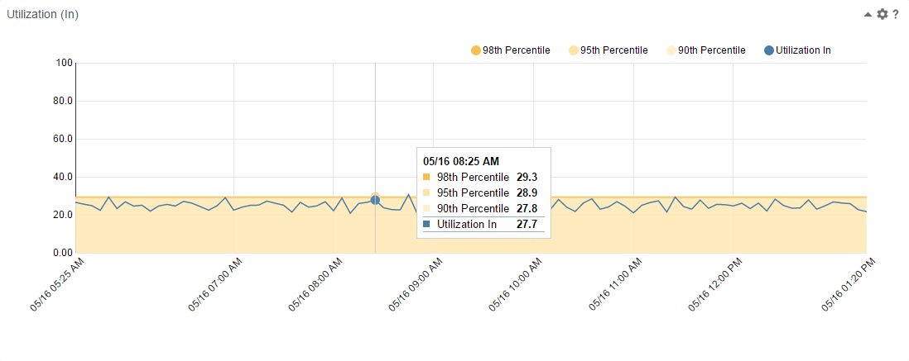

# percentileTrends
An interactive trend view of a metric of an interface with percentile data shown under the trend.

Based on the NVD3 library.

#### Install and Configure

1. Download the folder containing the app (e.g., click Download ZIP above). Unzip the download if need be and make sure the unzipped folder is named percentileTrends.
2. Copy the folder to the webapps/pc/apps/user directory of your PC installation.  This is normally:  
        /opt/CA/PerformanceCenter/PC/webapps/pc/apps/user  
There is no need to start or restart PC.
3. In PC, open a context page for an interface (Inventory -> Interfaces) and edit one of the tabs of the context page.
4. Add a browser view to the page. Configure the browser view with:  
   * an appropriate title,  
   * a height of 400,  
   * the URL as described below.  
5. Save your modified context page and see the app work.

#### CAPC Browser View URL

The URL used to run the app is:

/pc/apps/user/percentileTrends/index.html?id={ItemIdDA}&startTime={TimeStartUTC}&endTime={TimeEndUTC}&metric=im_UtilizationIn

Parameters:  
id: is the ID of the interface for the selected context page  
startTime: is the start time selected in the context page's time picker  
endTime: is the end time selected in the context page's time picker
metric: the OpenAPI name of the metric to display.  Must be part of the interface (portmfs) metric family.

#### Modifying the App
>>>>>>> origin/master

===================================================================================

License (refer to license.txt in folder for 3rd party license details)

Copyright (c) 2016 CA Technologies
 
The MIT License

Permission is hereby granted, free of charge, to any person obtaining a copy of this software and associated documentation files (the "Software"), to deal in the Software without restriction, including without limitation the rights to use, copy, modify, merge, publish, distribute, sublicense, and/or sell copies of the Software, and to permit persons to whom the Software is furnished to do so, subject to the following conditions:
 
The above copyright notice and this permission notice shall be included in all copies or substantial portions of the Software.
 
THE SOFTWARE IS PROVIDED "AS IS", WITHOUT WARRANTY OF ANY KIND, EXPRESS OR
IMPLIED, INCLUDING BUT NOT LIMITED TO THE WARRANTIES OF MERCHANTABILITY,
FITNESS FOR A PARTICULAR PURPOSE AND NONINFRINGEMENT. IN NO EVENT SHALL THE
AUTHORS OR COPYRIGHT HOLDERS BE LIABLE FOR ANY CLAIM, DAMAGES OR OTHER
LIABILITY, WHETHER IN AN ACTION OF CONTRACT, TORT OR OTHERWISE, ARISING FROM,
OUT OF OR IN CONNECTION WITH THE SOFTWARE OR THE USE OR OTHER DEALINGS IN
THE SOFTWARE.

===================================================================================
